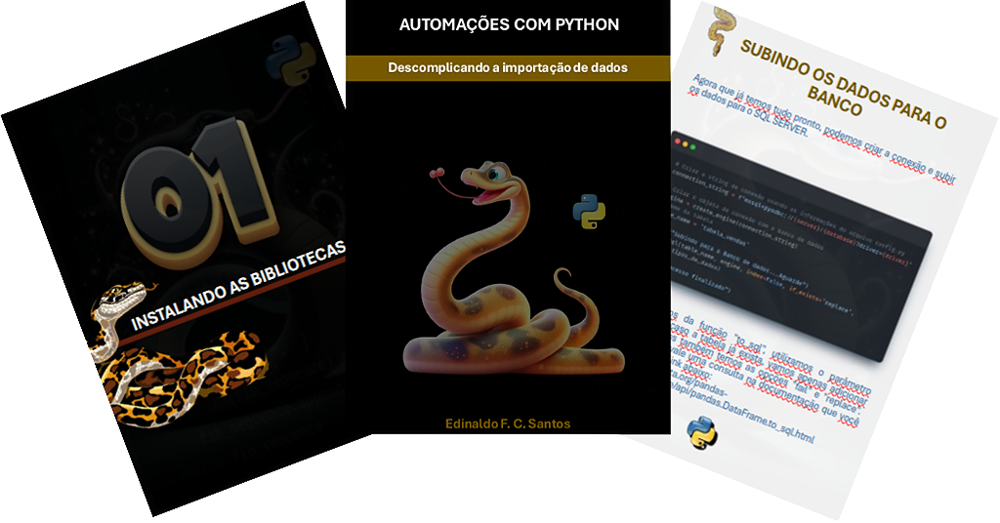

# Projeto EBOOK Gerado por I.A.s

 > ℹ️ **NOTE:** Este é o repositório desenvolvido durante o bootcamp Santander 2024 - Fundamentos de IA para Devs, como parte de um dos desafios, na plataforma [DIO](https://dio.me)

<a href="https://github.com/edinaldofcs/DIO_CHALLENGES/blob/desenvolvimento/EBOOK/output/ebook%20-%20automa%C3%A7%C3%B5es%20com%20python.pdf" title="View PDF"> 📕Clique aqui para ler</a>

## 💻 Tecnologias utilizadas no projeto
- [ChatGPT](https://chat.openai.com/) 
- [Bing](https://www.bing.com/) (geração de imagens)
- [Snappify](https://snappify.com/)
- [PowerPoint](https://www.microsoft.com/en/microsoft-365/powerpoint)
- [Clipdrop](https://clipdrop.co/)
- [Canva](https://www.canva.com/)

## 🧠 Prompts

### ChatGPT e Copilot：

| Ação              | Prompt                                                                                                                                                                              |
|-------------------|-------------------------------------------------------------------------------------------------------------------------------------------------------------------------------------|
| considerações iniciais | Atue como um escritor de ebook profissional para o ramo tech. Meu ebook deve ensinar a subir dados para o sql server com python, usando o seguinte código: - (parte de um código que utilizo no dia a dia) Use escrita animada/divertida e não seja muito técnico. |
| Regras            | {REGRAS} Seu público e jovem (entre 16 e 30 anos) Linguagem a ser utilizada (python) Pode usar palavras como pessoal, ou galera o Ebook será postado no linkedin cada página do ebook terá entre 30 e 60 palavras Subdivida em cápitulos de forma a ficar progressivo por tópico. use um dataset público de exemplo comece falando algo tipo: "imagine que você recebe uma base de excel para subir para o banco de dados do sql server. primeiro você teria que abrir a planilha, tratar os dados , para ficar no formato que o importador do sql entenda, salvar o arquivo em csv (caso esteja em outro formato, abrir o importador do sql e.... ah, cansei só de falar)". coloque os dados sensiveis em um outro arquivo e importe também |
| Estrutura         | {ESTRUTURA} Introdução: PROBLEMAS DO DIA A DIA​ INSTALANDO AS BIBLIOTECAS: BIBLIOTECAS NECESSÁRIAS​ ABRINDO O ARQUIVO​: LENDO OS DADOS COM PANDAS FORMATANDO PARA O SQL SERVER​: TRANSFORMANDO DADOS​ PROTEGENDO DADOS SENSÍVEIS​: SEGURANÇA DAS INFORMAÇÕES​ SUBINDO DADOS PARA O BANCO: Criando a Conexão REFATORANDO​: HORA DE REFATORAR​ CONCLUSÃO |

### Copilot：

| Ação                        | Prompt                                                                                                                                                                                       |
|-----------------------------|----------------------------------------------------------------------------------------------------------------------------------------------------------------------------------------------|
| INSTRUÇÃO COPILOT           | Create a whimsical 3D illustration of a Python snake, inspired by Disney animations, with a black background. The snake should be depicted in a lively and dynamic pose, embodying the playful spirit of Disney characters. This illustration aims to capture the essence of Python automation while incorporating the magical and enchanting style of Disney animation. |

## ✨ Features

- Conteúdo gerado via ChatGPT e Copilot
- Imagens geradas via Copilot
- Imagens tratadas no CripDrop
- PDF gerado no powerpoint online

## 📚 Materiais

- Imagens utilizadas em `assets`
- ebook gerado em `output`

## 🛠️ Instruções de execução

Utilize os prompts acima nas ferramentas sugeridas para gerar o material base e utilize uma ferramenta de edição de documentos como power point, e algum editor de textos para diagramação. teste os prompts em diversos chats e utilize mais de uma opção de chat para ir refinando os resultados. Por fim, altere de acordo com sua criatividade e com os resultados esperados.
