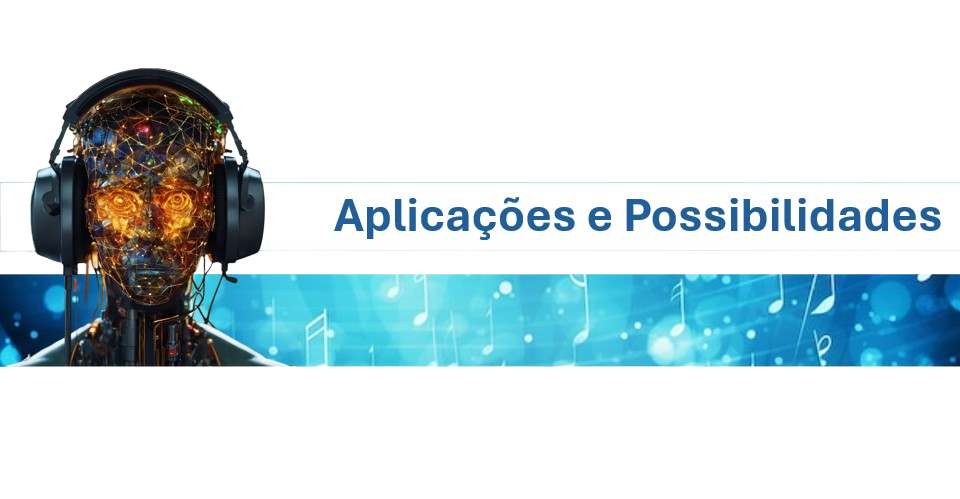
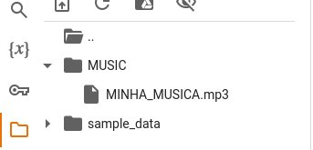
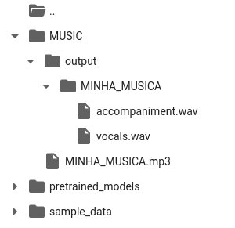
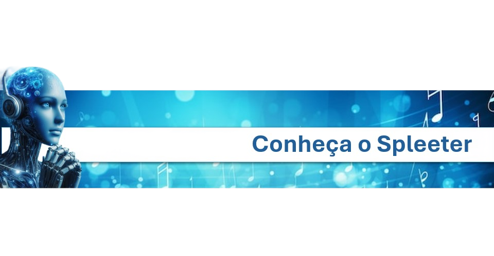

# Introdução

Se você já se viu querendo isolar os vocais de uma música, seja para praticar um instrumento, remixar uma faixa ou simplesmente estudar a técnica vocal de um artista, provavelmente já enfrentou a frustração de buscar por ferramentas que realizem essa tarefa de forma eficiente. e as que você encontram, geralmente são complexas, ou cheias de anúncios. Porém, com os avanços da inteligência artificial (IA), agora é possível separar vocais e instrumentais de maneira precisa, gratuita e acessível a todos, utilizando Python e uma poderosa biblioteca chamada Spleeter.


A inteligência artificial tem desempenhado um papel revolucionário em diversas áreas, e a música não é exceção. Com algoritmos complexos e redes neurais treinadas em vastos conjuntos de dados, a IA é capaz de analisar e reconhecer padrões em áudios com uma precisão surpreendente. Isso permite que ferramentas como o Spleeter sejam desenvolvidas, proporcionando um novo nível de controle e criatividade na manipulação de músicas.



O Spleeter é uma biblioteca de código aberto desenvolvida pelo Deezer Research, projetada especificamente para separar fontes de áudio em diferentes faixas. Utilizando uma arquitetura de rede neural, o Spleeter pode isolar os vocais, os instrumentais e até mesmo outras partes de uma música.O resultado são várias faixas individuais, cada uma contendo um componente específico da música.


## Como Utilizar o Spleeter para Separar Vocais e Instrumentais


O Spleeter opera em um processo simples, mas poderoso. Primeiro, você fornece uma música de entrada em um dos formatos suportados. Em seguida, o Spleeter usa sua inteligência artificial para analisar o áudio e separar as diferentes fontes sonoras. O resultado são várias faixas individuais, cada uma contendo um componente específico da música, como os vocais ou os instrumentais.


### 1.Preparação do ambiente


Antes de começar, certifique-se de ter acesso ao Google Colab, uma plataforma de código aberto baseada em nuvem que facilita a execução de códigos Python. Em seguida, execute o seguinte código para instalar o Spleeter


```python
pip install spleeter
```

### 2.Carregando a música


Faça o upload da música que deseja separar para o Google Colab. Certifique-se de que o arquivo esteja no formato adequado e que você tenha permissão para utilizá-lo. Coloque o arquivo em uma pasta de sua preferência. Aqui, vamos criar uma pasta chamada MUSIC




### 3.Usando o Spleeter

Utilize o Spleeter para inicializar o separador e especificar o número de faixas desejadas. Para separar apenas os vocais e os instrumentais, você pode optar pela configuração de 2 stems.

```python
from spleeter.separator import Separator
from google.colab import files

name_file = 'MINHA_MUSICA'
extension = '.mp3'
audio_path = '/content/MUSIC/' + name_file + extension

# Inicializa o separador
separator = Separator('spleeter:2stems')  # 2 stems: voz e acompanhamento
# Separar a música original em faixas
separator.separate_to_file(audio_path, '/content/MUSIC/output')

```


Feito isso, dentro da pasta MUSIC, será criada uma pasta chamada OUTPUT e dentro desta pasta você verá os arquivos já separados por faixas e prontos para serem baixados.



### 4.Baixando as Faixas

Uma vez concluída a separação, baixe as faixas resultantes para o seu computador. Você agora tem acesso aos vocais e aos instrumentais individuais da música.

```python

file_path = '/content/MUSIC/output/'+ name_file + '/vocals.wav'
files.download(file_path)

```
  

A separação de vocais e instrumentais abre as portas para uma infinidade de aplicações criativas e práticas. Aqui estão algumas maneiras pelas quais você pode utilizar essa técnica inovadora:

Remixes e Mashups: Combine os vocais de uma música com os instrumentais de outra para criar remixes exclusivos e cativantes.
Karaokê Personalizado: Remova os vocais de uma música para criar versões personalizadas para karaokê.
Análise de Áudio: Analise separadamente os vocais e os instrumentais de uma música para estudar sua estrutura e composição de maneira mais detalhada.
Estudos técnicos: Aprenda um instrumento de forma isolada.


  
# Conclusão


Com o Spleeter e outras ferramentas de inteligência artificial, a separação de vocais e instrumentais em músicas nunca foi tão acessível e poderosa. Seja para explorar novas formas de expressão musical, estudar técnicas instrumentais ou simplesmente se divertir.


Fontes e referências:

Lib spleeter: https://github.com/deezer/spleeter

Imagens e conteúdos gerados pelo Copilot, com revisão e aprimoramentos 100% feitos por Humano: https://www.bing.com/chat