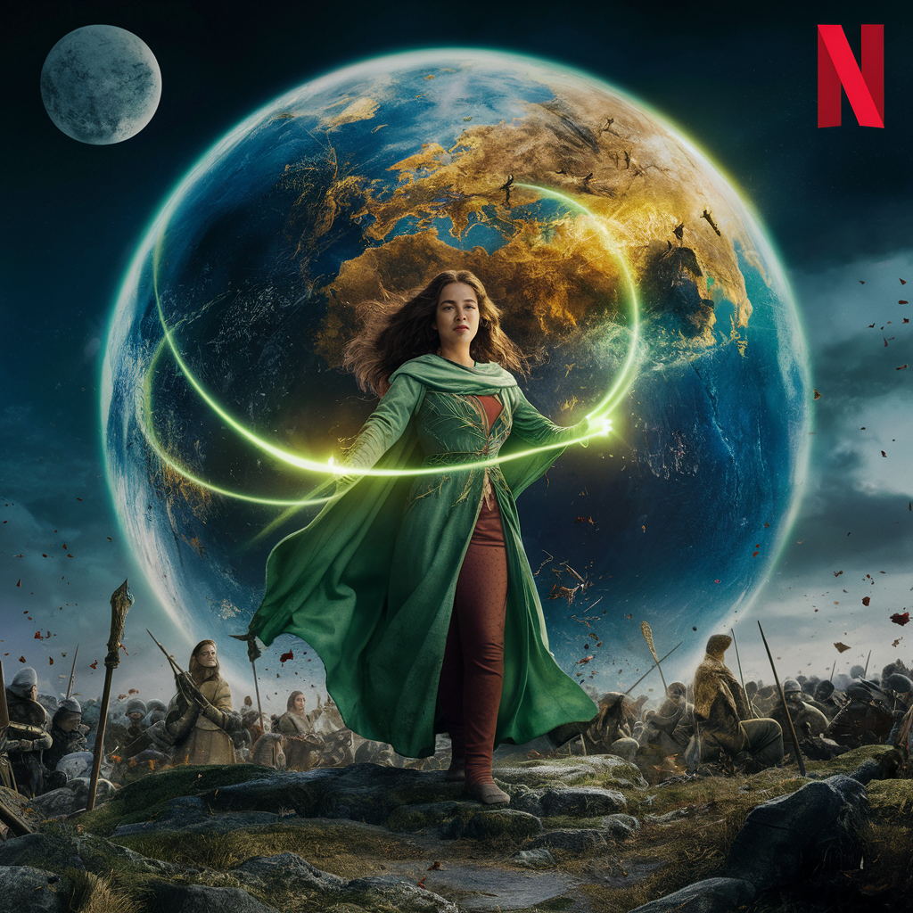

    Áudio do podcast

    <audio src="src/output/Podcast_editado.mp3" controls title="Podcast editado"></audio>

# Projeto Podcast Gerado por I.A.s

Projeto com o objetivo de gerar um podcast utilizando ferramentas de IA através de prompts otimizados

## 💻 Tecnologias utilizadas no projeto

- [ChatGPT](https://chat.openai.com/) 
- [Ideogram](https://www.ideogram.ai)
- [ElevenLabs](https://www.beta.elevenlabs.io/)
- [TTSMAKER](https://www.ttsmaker.com)
- [Capcut](https://www.capcut.com/pt-br/)

## ✨ Como foi feito ?

- Roteiro gerado via chatgpt
- Audio gerado pela elevenLabs e TtsMaker
- Ideogram Para gerar capa
- Capcut para tratar aúdio e adicionar sons de fundo

## 🛠️ Instruções de execução

Utilize os prompts dentro da pasta prompts criar um podcast de maneira automatizada, para isso siga o passo a passo abaixo.

- 🤖 1. Use os prompts de chat no `chagpt`
- 🤖 2. Use os prompts de roteiro gerados pelo chatgpt no  `ElevenLabs` e/ou `TtsMaker` 
- 🤖 3. Use os prompts de artes no `Ideogram`

## Possíveis próximos capitulos

- Alianças e Traições: O Preço do Poder
- A Ascensão de Torin: Poder e Ambição
- A Batalha de Kaelthor: Resistência e Coragem
- Memórias Compartilhadas: Verdades Reveladas
- A Última Esperança: A Batalha dos Destinos
- As Alianças Sombrias
- O Fogo da Ambição
- O Encontro com a Verdade
- O Fim dos Clãs: Regresso ao Futuro